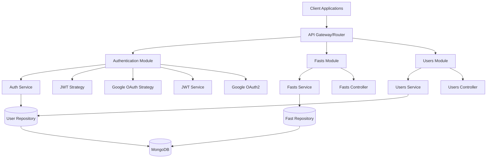

# Design Document: Rayyan Backend API

## Overview

The Rayyan Backend API is a NestJS-based RESTful service for tracking daily fasting activities. The system implements a modular architecture with three core modules: Authentication, Fasts Management, and User Management. The API provides secure JWT-based authentication with Google OAuth2 integration, comprehensive CRUD operations for fast tracking, and robust user profile management.

The architecture follows NestJS best practices with dependency injection, decorators, and modular design patterns. The system uses MongoDB as the primary database with Mongoose ODM for data modeling and validation.

## Architecture

### System Architecture



### Module Structure

**Authentication Module**
- Handles user login, registration, and JWT token management
- Integrates Google OAuth2 for third-party authentication
- Provides guards and strategies for route protection

**Fasts Module**
- Manages CRUD operations for fast records
- Handles bulk operations and missed fast queries
- Enforces user ownership and data validation

**Users Module**
- Manages user profile data and account operations
- Handles password hashing and user data validation
- Provides user lookup and management services

### Request Flow

1. **Authentication Flow**: Client → Auth Controller → Auth Service → JWT Strategy → Database
2. **Protected Resource Flow**: Client → JWT Guard → Controller → Service → Repository → Database
3. **OAuth Flow**: Client → Google OAuth → Callback Handler → Auth Service → JWT Token

## Components and Interfaces

### Core Entities

**User Entity**
```typescript
interface User {
  _id: ObjectId;
  firstName: string;
  lastName: string;
  email: string;
  password: string; // bcrypt hashed
  googleId?: string; // for OAuth users
  createdAt: Date;
  updatedAt: Date;
}
```

**Fast Entity**
```typescript
interface Fast {
  _id: ObjectId;
  name: string; // DD-MM-YYYY format
  description: string;
  status: boolean; // true = observed, false = missed
  user: ObjectId; // reference to User
  createdAt: Date;
  updatedAt: Date;
}
```

### Service Interfaces

**Authentication Service**
```typescript
interface IAuthService {
  login(email: string, password: string): Promise<AuthResponse>;
  register(userData: CreateUserDto): Promise<AuthResponse>;
  validateUser(email: string, password: string): Promise<User | null>;
  generateJwtToken(user: User): string;
  handleGoogleAuth(profile: GoogleProfile): Promise<AuthResponse>;
}
```

**Fasts Service**
```typescript
interface IFastsService {
  createFast(userId: string, fastData: CreateFastDto): Promise<Fast>;
  getUserFasts(userId: string): Promise<Fast[]>;
  getFastById(fastId: string, userId: string): Promise<Fast>;
  updateFastStatus(fastId: string, userId: string, status: boolean): Promise<Fast>;
  getMissedFasts(userId: string): Promise<Fast[]>;
  createBulkFasts(userId: string, fastsData: CreateFastDto[]): Promise<Fast[]>;
}
```

**Users Service**
```typescript
interface IUsersService {
  createUser(userData: CreateUserDto): Promise<User>;
  findUserByEmail(email: string): Promise<User | null>;
  findUserById(id: string): Promise<User | null>;
  updateUser(id: string, updateData: UpdateUserDto): Promise<User>;
  hashPassword(password: string): Promise<string>;
  validatePassword(password: string, hash: string): Promise<boolean>;
}
```

### DTOs and Validation

**Authentication DTOs**
```typescript
class LoginDto {
  @IsEmail()
  email: string;
  
  @IsString()
  @MinLength(6)
  password: string;
}

class RegisterDto {
  @IsString()
  @MinLength(2)
  firstName: string;
  
  @IsString()
  @MinLength(2)
  lastName: string;
  
  @IsEmail()
  email: string;
  
  @IsString()
  @MinLength(8)
  @Matches(/^(?=.*[a-z])(?=.*[A-Z])(?=.*\d)/)
  password: string;
}
```

**Fast DTOs**
```typescript
class CreateFastDto {
  @IsString()
  @Matches(/^\d{2}-\d{2}-\d{4}$/)
  name: string; // DD-MM-YYYY format
  
  @IsString()
  @IsOptional()
  description?: string;
}

class UpdateFastStatusDto {
  @IsBoolean()
  status: boolean;
}

class BulkFastsDto {
  @IsArray()
  @ValidateNested({ each: true })
  @Type(() => CreateFastDto)
  fasts: CreateFastDto[];
}
```

## Data Models

### Database Schema Design

**Users Collection**
```javascript
{
  _id: ObjectId,
  firstName: String (required, min: 2),
  lastName: String (required, min: 2),
  email: String (required, unique, lowercase),
  password: String (required, bcrypt hashed),
  googleId: String (optional, for OAuth),
  createdAt: Date (default: now),
  updatedAt: Date (default: now)
}
```

**Fasts Collection**
```javascript
{
  _id: ObjectId,
  name: String (required, format: DD-MM-YYYY),
  description: String (optional),
  status: Boolean (required, default: false),
  user: ObjectId (required, ref: 'User'),
  createdAt: Date (default: now),
  updatedAt: Date (default: now)
}
```

### Mongoose Schemas

**User Schema**
- Email uniqueness index
- Password field excluded from queries by default
- Virtual fields for full name
- Pre-save middleware for password hashing
- Timestamps enabled

**Fast Schema**
- Compound index on user + name for uniqueness per user
- Index on user field for efficient queries
- Index on status field for missed fast queries
- Validation for date format in name field
- Timestamps enabled

### Data Relationships

- **User → Fasts**: One-to-Many relationship
- **Fast.user**: References User._id with referential integrity
- **Cascade Operations**: User deletion should handle associated fasts
- **Query Optimization**: Indexes on frequently queried fields (user, status, createdAt)

## Error Handling

### Exception Hierarchy

**Custom Exceptions**
```typescript
class AuthenticationException extends HttpException {
  constructor(message: string) {
    super(message, HttpStatus.UNAUTHORIZED);
  }
}

class ValidationException extends HttpException {
  constructor(errors: ValidationError[]) {
    super({ message: 'Validation failed', errors }, HttpStatus.BAD_REQUEST);
  }
}

class ResourceNotFoundException extends HttpException {
  constructor(resource: string, id: string) {
    super(`${resource} with id ${id} not found`, HttpStatus.NOT_FOUND);
  }
}

class ForbiddenResourceException extends HttpException {
  constructor(resource: string) {
    super(`Access denied to ${resource}`, HttpStatus.FORBIDDEN);
  }
}
```

### Global Exception Filter

```typescript
@Catch()
export class GlobalExceptionFilter implements ExceptionFilter {
  catch(exception: unknown, host: ArgumentsHost) {
    const ctx = host.switchToHttp();
    const response = ctx.getResponse();
    const request = ctx.getRequest();

    let status = HttpStatus.INTERNAL_SERVER_ERROR;
    let message = 'Internal server error';

    if (exception instanceof HttpException) {
      status = exception.getStatus();
      message = exception.getResponse();
    }

    const errorResponse = {
      statusCode: status,
      timestamp: new Date().toISOString(),
      path: request.url,
      method: request.method,
      message: message
    };

    response.status(status).json(errorResponse);
  }
}
```

### Error Response Format

```typescript
interface ErrorResponse {
  statusCode: number;
  timestamp: string;
  path: string;
  method: string;
  message: string | object;
  errors?: ValidationError[];
}
```

## Testing Strategy

### Testing Approach

The Rayyan Backend API will implement a comprehensive dual testing strategy combining unit tests for specific scenarios and property-based tests for universal correctness validation.

**Unit Testing Focus:**
- Controller endpoint behavior and response formatting
- Service method logic with mocked dependencies
- Authentication guard and strategy functionality
- DTO validation with specific input examples
- Error handling scenarios and edge cases
- Database integration with test database

**Property-Based Testing Focus:**
- Universal properties that must hold across all valid inputs
- Data integrity and consistency properties
- Authentication and authorization invariants
- API contract compliance across input variations

**Testing Configuration:**
- **Framework**: Jest with NestJS testing utilities
- **Property Testing Library**: fast-check for TypeScript
- **Database Testing**: MongoDB Memory Server for isolated tests
- **Property Test Iterations**: Minimum 100 iterations per property
- **Coverage Target**: 90% code coverage minimum

**Test Organization:**
- Unit tests: `*.spec.ts` files co-located with source
- Property tests: `*.property.spec.ts` files in test directories
- Integration tests: `test/` directory with end-to-end scenarios
- Test utilities: Shared factories and helpers in `test/utils/`

**Property Test Tagging:**
Each property test must include a comment tag referencing the design document property:
```typescript
// Feature: rayyan-backend-api, Property 1: Authentication token generation consistency
```

### Unit Testing Strategy

**Controller Testing:**
- Mock all service dependencies
- Test HTTP status codes and response formats
- Validate request/response transformations
- Test authentication guard integration
- Verify error handling and exception mapping

**Service Testing:**
- Mock repository/database dependencies
- Test business logic with various input combinations
- Validate data transformation and processing
- Test error conditions and exception throwing
- Verify integration with external services (OAuth)

**Integration Testing:**
- Test complete request/response cycles
- Validate database operations with test data
- Test authentication flows end-to-end
- Verify API contract compliance
- Test error scenarios across module boundaries